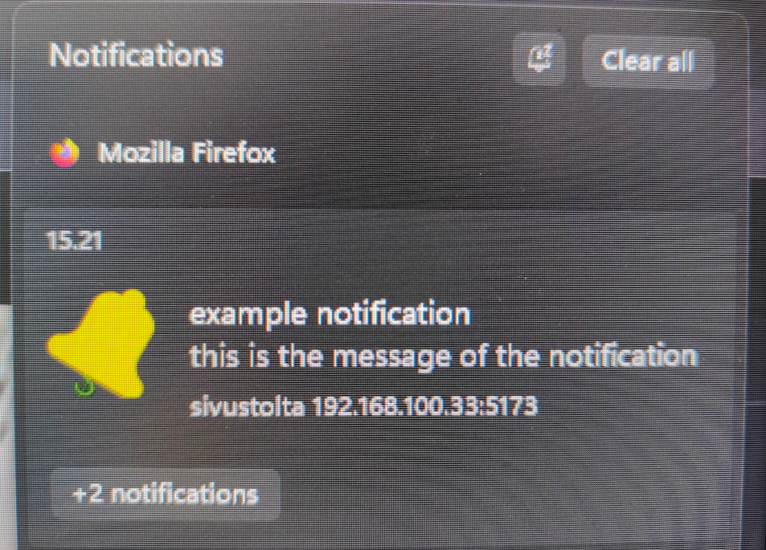

# Subscription-Reminder


**Made as a degree work for a course.**

a Complete website, that uses push notifications to remind users of their subscriptions. Users add their subscriptions to the website and then can choose which subscriptions they want to be reminded of. push notification is send to the device where "remind" button is pressed.

Backend is made with nodejs, web-push and express. Frontend works with vite, react and react-router-dom. 

## Features

- jwt login system
- push notifications
- responsive UI
- REST API

## Important

**chrome(browser) doesn't let you send push notifications with self signed ssl, so to test this project use browser like firefox that let's you send push notifications with self signed ssl.**

The "unixtimestamps" in this project are in milliseconds.

Push notifications require SSL and if you're using self signed certificate, you will first need to go to the root route of backend, Example ```https://192.168.100.33:5001/```. This is just a route that will redirect you to the frontend. When first time accessing this route it will ask to allow "unsecure" connection or something similar, because the ssl is self signed. If you directly go to the frontend, the frontend most likely can't access the backend, because the "unsecure" connection has not been allowed. So by connecting to the backend and allowing the "unsecure" connection, now the frontend should be able communicate with the backend. 

For now both backend and frontend use the same ssl, but for better security you should use different keys for both, backend and frontend.


## screenshots

Dashboard view


Push notification send by the website




## API

API documentation in ```/backend/README.md```

## How to run/test

1. run the following command in the root folder of this project ```openssl req -x509 -sha256 -nodes -days 365 -newkey rsa:2048 -keyout private.key -out certificate.crt```. This creates the self signed SSL, that push notifications require. This command also requires ```openssl```, to be installed

2. Create ```.env``` file to ```/backend```. Example of ```.env``` can be found from ```/backend/example.env```. 

- To create vapid keys, first install web-push globaly ```npm install web-push -g``` and then run ```web-push generate-vapid-keys [--json]```

- ```SERVER_SECRET``` should be long string of random characters.

3. Add correct backend url and vapid public key to ```/frontend/src/const.js``` 

4. Run backend in ```/backend``` directory with command ```npm run nodemon```.

5. Run frontend in ```/frontend``` directory, with command ```npm run dev```

6. **if using self signed sll**, at first the users must go to the root route of the backend(Explained in ```Important``` section).

**Note** if you want to host this aplication, you should build frontend and backend.

## How notifications work

In backend ```notificationHandler.js``` runs interval, that checks every 5 minutes if it is time to send notification. Notifications are saved in mongodb.

Notification from subscription can only be send to **1** device( could be send to multiple devices, but to keep things simple it is limited to one device.).
